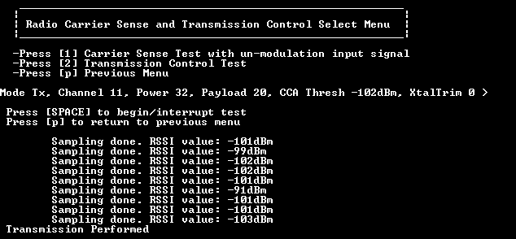
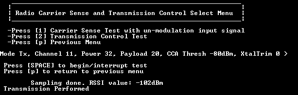

# Carrier Sense Test with unmodulated input signal

This test performs a “manual” Clear Channel Assessment procedure. First, an energy request procedure is done to obtain the RSSI on the specified channel. Then, the obtained RSSI is compared against CCA threshold value, which can be manually set by issuing shortcut commands **\[l\]**and **\[k\].**

If the obtained RSSI value for the specified channel is greater than the CCA threshold value, then the channel is considered busy, no transmission is issued on that channel and another energy detect request is started. This is shown in the below figure. 
**Carrier Sense Test when RSSI is greater than CCA Threshold**

However, if the obtained RSSI value for the specified channel is lower than the CCA Threshold value, then the channel is considered as Idle. It indicates that a transmission has occurred and therefore, the test ends. This is shown in in the below figure. 
**Carrier Sense Test when RSSI is lower than CCA Threshold**

**Parent topic:**[Carrier Sense and Transmission Control Select menu](../topics/carrier_sense_and_transmission_control_select_menu.md)

