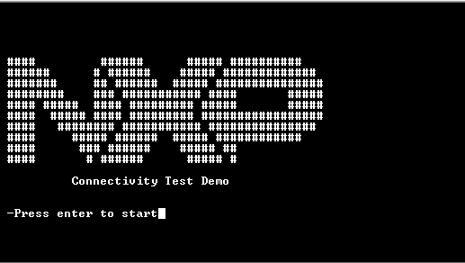
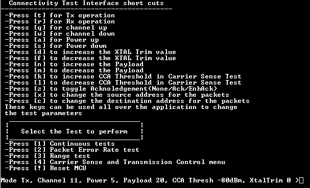

# CLI initialization and description

The figure below shows how the Command Line Interface \(CLI\) menu of the **812.15.4 Connectivity Test application** appears at start-up. 

Press “**Enter**” on the message prompt. The full CLI menu is displayed as shown in the figure below. 

**Connectivity Test Demo CLI**

The CLI is divided into three main categories:

1.  **Shortcuts**: This category provides configuration options that can be used in the tests performed. Shortcuts can be used within any accessed test menu to change the test parameters.
2.  **Tests**: This category provides the test that can be performed. Each test category numbered from 1 to 4 contains additional options.
3.  **Device state**: This category indicates the current state of the device. The device state can be modified according to user preference by using the shortcut keys available by the CLI. Device state is displayed within any test menu and is refreshed every time a shortcut command is issued. Device state is not shown when tests are in progress.

**Parent topic:**[Connectivity Test CLI](../topics/connectivity_test_cli.md)

