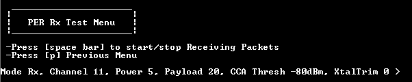
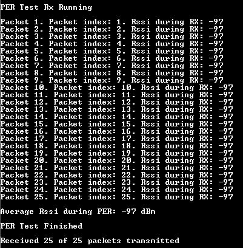

# Packet error rate menu when the device is set as receiver

When the device is set to receiver mode, the user is only asked to start or stop the receiving sequence as shown in the figure below. 

**PER menu interface for RX device**

After the receiving sequence begins, incoming packages with destination address set to device’s destination address are shown in the figure below.  **Running PER on RX side**

**Parent topic:**[Packet Error Rate \(PER\) menu](../topics/packet_error_rate_menu.md)

