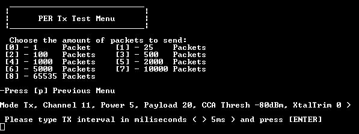
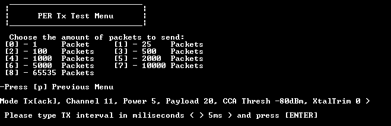
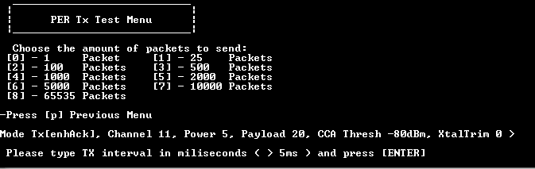
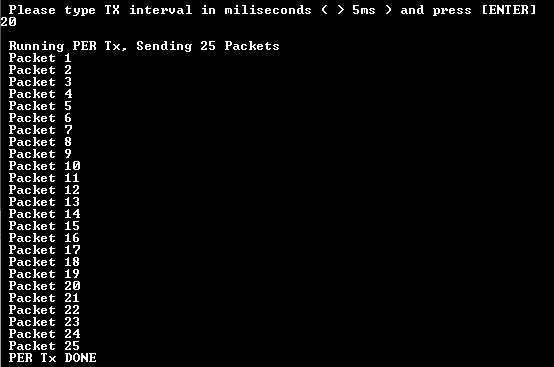
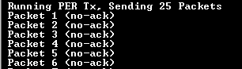

# Packet error rate when the device is set as transceiver

When the device is set to Transmitter mode, it prompts the user to indicate the following:

-   The number of packets that should be transmitted during the test.
-   The transmission interval between two consecutive packets.

See the figure below.  
**Configuring PER for TX device with no ACK**

If the acknowledgment setting has not been previously defined, users can decide whether acknowledgment should be present or not.

The type of acknowledgments that can be used by issuing shortcut commands can also be set. See the figure below.  
**Configuring PER for TX device with ACK**

See the figure below.
**Configuring PER for TX device with Enhanced ACK**

With everything being set, the device starts transmitting the packets over the air as shown in the figure below.  
**Running PER on TX side**

The packet or sequence of packets that have not been acknowledged are indicated on the transmitter CLI. This is applicable for transmissions with acknowledgement or enhanced acknowledgment set, if the receiver device does not send an acknowledgment as required. See the figure below.   

**Example of not acknowledged packets**
  

**Parent topic:**[Packet Error Rate \(PER\) menu](../topics/packet_error_rate_menu.md)

