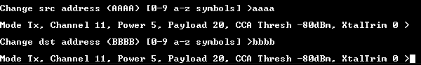
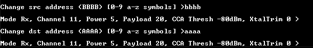
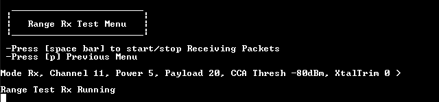
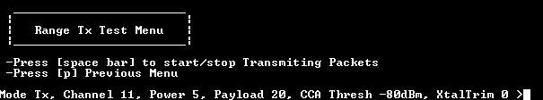
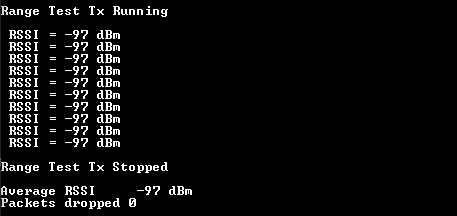
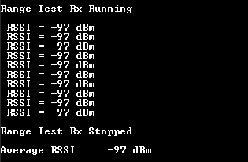

# Steps to perform a Range Test procedure

The steps to perform a Range Test procedure are as follows:

1.  Set the source and destination address of the transmitter device: `source=0xaaaa`, `destination=0xbbb`. \(Any other addresses can be chosen\). See the figure below.    
**Range Test: Set the source and destination addresses on TX side**
    

2.  Set the source and destination address of the receiver device.

    For example, `source=0xbbbb`, `destination=0xaaaa`. \(Any other addresses can be chosen\). See the figure below.    
   **Range Test: Set the source and destination addresses on RX side**
    

3.  Set the receiver device to run as shown in the figure below.    
   **Range Test: Set the RX device to run**
    

4.  Set the transmitter device to run.

    TX device CLI messages are shown in the figures below.    
    **Range Test: TX device CLI messages**
    
    **TX device CLI messages**
    

5.  Receiver device CLI messages are as shown in the figure below.      **Range Test: RX device CLI messages**   

    

**Parent topic:**[Range Test menu](../topics/range_test_menu.md)

