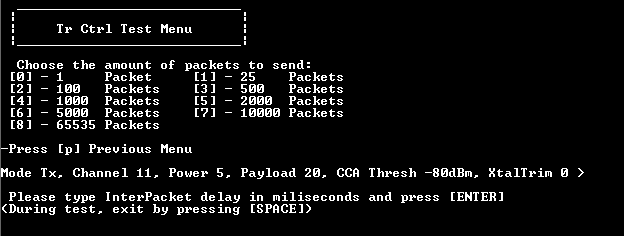
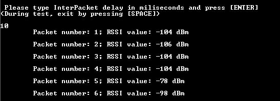
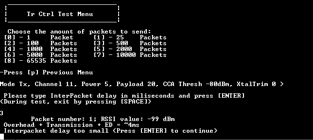

# Steps to perform a Transmission Control Test

The figure below illustrates the Transmission Control Test menu. 
**Transmission Control Test menu**

The process to conduct the Transmission Control Test is as follows:

1.  Select the number of packets to be sent.
2.  Specify the inter-packet delay. \(Transmission delay between two consecutive packets\).

The figure shows this process.  
**Transmission Control Test execution**

This test also calculates an approximation of time needed to perform the Overhead + Transmission + Energy Detect procedure.

If the inter-packet delay has a value lower than the estimation previously calculated, a corresponding message is shown, and the test finishes the execution as shown in the figure below. 
**Transmission Control Test – Inter-Packet delay error**

**Parent topic:**[Transmission Control test](../topics/transmission_control_test.md)

