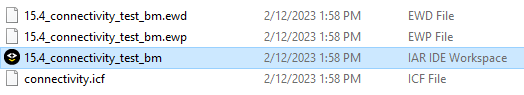
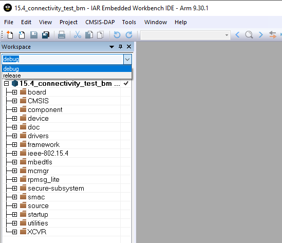
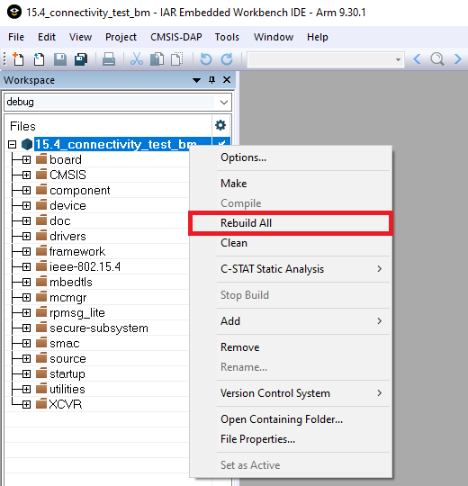
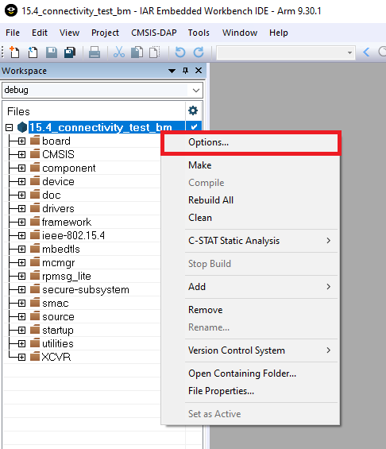
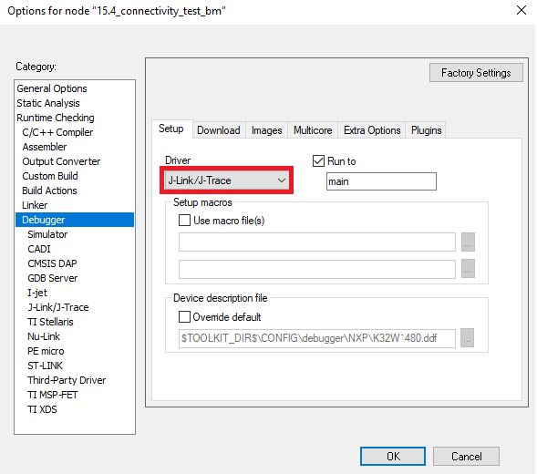
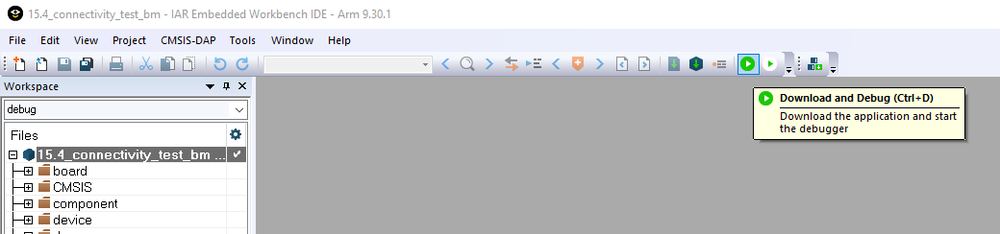

# Building and flashing the Connectivity Test application using IAR

1.  **Step 1**: Navigate to the Connectivity Test Application location described above.

2.  **Step 2**: Open the highlighted IAR IDE Workspace file \(`*.eww` file format:\)

    

3.  **Step 3**:Select the desired configuration for the Connectivity Test Application project:

    

4.  **Step 4**: Build the project.

    

5.  **Step 5**: Make the appropriate debugger settings in the project options window:

    

    

6.  **Step 6**: Click the “**Download and Debug**” button to flash the executable onto the board.

    

