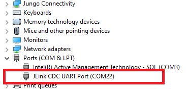
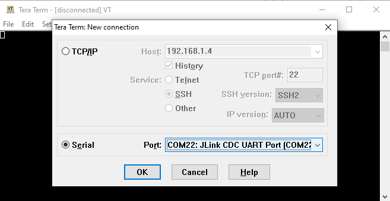
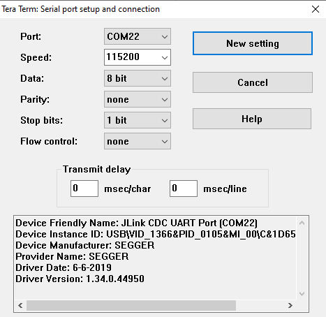
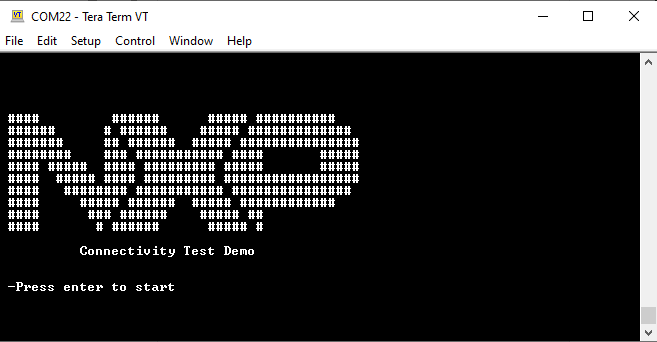

# Running the Connectivity Test application

This section demonstrates the basic steps to run a demo application.

**Note:** For detailed information about the Connectivity Test Application, refer to the “*Connectivity Test Application Command Line Interface User Guide*" included in the package \(*CTACLIUG\_Rev0.pdf*\).

In order to connect to the board, the Connectivity Test application requires a serial terminal program. This example uses Tera Term for this purpose.

1.  **Step 1**: Load the application on the board using IAR Embedded Workbench for Arm by clicking “**Download and Debug**”.
2.  **Step 2**: After loading the application, check “**Device Manager**” to get the serial port number. This should appear with the prefix "**JLink**”.

    

3.  **Step 3**: Using the port numbers specified in Device Manager, open a Tera Term instance and connect to the device using the 115200 baud rate. To change the baud rate of the terminal go to the “**Setup**-\> **Serial Port**” menu.

    

    

4.  **Step 4**: Start the application by pressing the “**Enter**” key. Any other key displays the logo screen again.

    

5.  Follow the on-screen instructions to run each test. If a test needs a second platform, follow the steps above to set it up.

